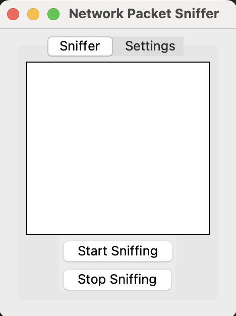

# Network Packet Sniffer

This is a simple Network Packet Sniffer application built using Python. It features a graphical user interface (GUI) that allows users to capture and display network packets in real-time.

## Features

- Capture network packets using Scapy.
- Display captured packets in a list.
- Start and stop packet sniffing with buttons.
- Basic settings tab for future enhancements.

## Screenshot
<div align="center">
   
</div>

## Requirements

- Python 3.x
- Scapy
- Tkinter (usually comes pre-installed with Python)

## Installation

1. Clone the repository or download the `packet_sniffer.py` file.
2. Install the required libraries using pip:

   ```bash
   pip install -r requirements.txt
   ```

3. Run the application:

   ```bash
   sudo python packet_sniffer.py
   ```

## Usage

- Click the "Start Sniffing" button to begin capturing packets.
- The captured packets will be displayed in the list box.
- Click "Stop Sniffing" to stop the capture.

## Note

Running this application may require administrative privileges depending on your operating system.

## License

This project is licensed under the [MIT License](https://opensource.org/licenses/MIT).